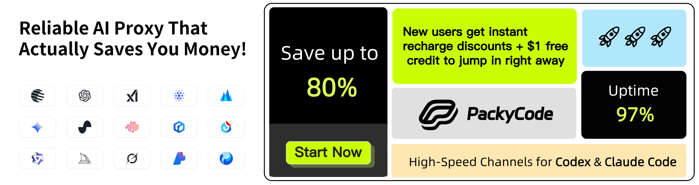

# CLI Proxy API

English | [中文](README_CN.md) | [日本語](README_JA.md)

A proxy server that provides OpenAI/Gemini/Claude/Codex compatible API interfaces for CLI.

It now also supports OpenAI Codex (GPT models) and Claude Code via OAuth.

So you can use local or multi-account CLI access with OpenAI(include Responses)/Gemini/Claude-compatible clients and SDKs.

## Sponsor

[](https://www.packyapi.com/register?aff=cliproxyapi)

Thanks to PackyCode for sponsoring this project!

PackyCode is a reliable and efficient API relay service provider, offering relay services for Claude Code, Codex, Gemini, and more.

PackyCode provides special discounts for our software users: register using <a href="https://www.packyapi.com/register?aff=cliproxyapi">this link</a> and enter the "cliproxyapi" promo code during recharge to get 10% off.

---

<table>
<tbody>
<tr>
<td width="180"><a href="https://www.aicodemirror.com/register?invitecode=TJNAIF"></a></td>
<td>Thanks to AICodeMirror for sponsoring this project! AICodeMirror provides official high-stability relay services for Claude Code / Codex / Gemini CLI, with enterprise-grade concurrency, fast invoicing, and 24/7 dedicated technical support. Claude Code / Codex / Gemini official channels at 38% / 2% / 9% of original price, with extra discounts on top-ups! AICodeMirror offers special benefits for CLIProxyAPI users: register via <a href="https://www.aicodemirror.com/register?invitecode=TJNAIF">this link</a> to enjoy 20% off your first top-up, and enterprise customers can get up to 25% off!</td>
</tr>
<tr>
<td width="180"><a href="https://shop.bmoplus.com/?utm_source=github"></a></td>
<td>Huge thanks to BmoPlus for sponsoring this project! BmoPlus is a highly reliable AI account provider built strictly for heavy AI users and developers. They offer rock-solid, ready-to-use accounts and official top-up services for ChatGPT Plus / ChatGPT Pro (Full Warranty) / Claude Pro / Super Grok / Gemini Pro. By registering and ordering through <a href="https://shop.bmoplus.com/?utm_source=github">BmoPlus - Premium AI Accounts & Top-ups</a>, users can unlock the mind-blowing rate of <b>10% of the official GPT subscription price (90% OFF)</b>!</td>
</tr>
<tr>
<td width="180"><a href="https://coder.visioncoder.cn"></a></td>
<td>Thanks to VisionCoder for supporting this project. <a href="https://coder.visioncoder.cn" target="_blank">VisionCoder Developer Platform</a> is a reliable and efficient API relay service provider, offering access to mainstream AI models such as Claude Code, Codex, and Gemini. It helps developers and teams integrate AI capabilities more easily and improve productivity.
<p></p>
VisionCoder is also offering our users a limited-time <a href="https://coder.visioncoder.cn" target="_blank">Token Plan</a> promotion: buy 1 month and get 1 month free.</td>
</tr>
</tbody>
</table>

## Overview

- OpenAI/Gemini/Claude compatible API endpoints for CLI models
- OpenAI Codex support (GPT models) via OAuth login
- Claude Code support via OAuth login
- ChatGPT web session support (`chatgpt-web/gpt-5-6-pro`, `--chatgpt-web-login`, Temporary Chat enforced)
- Amp CLI and IDE extensions support with provider routing
- Streaming, non-streaming, and WebSocket responses where supported
- Function calling/tools support
- Multimodal input support (text and images)
- Multiple accounts with round-robin load balancing (Gemini, OpenAI, Claude)
- Simple CLI authentication flows (Gemini, OpenAI, Claude)
- Generative Language API Key support
- AI Studio Build multi-account load balancing
- Gemini CLI multi-account load balancing
- Claude Code multi-account load balancing
- OpenAI Codex multi-account load balancing
- OpenAI-compatible upstream providers via config (e.g., OpenRouter)
- Reusable Go SDK for embedding the proxy (see `docs/sdk-usage.md`)

## Getting Started

CLIProxyAPI Guides: [https://help.router-for.me/](https://help.router-for.me/)

## Management API

see [MANAGEMENT_API.md](https://help.router-for.me/management/api)

## Usage Statistics

Since v6.10.0, CLIProxyAPI and [CPAMC](https://github.com/router-for-me/Cli-Proxy-API-Management-Center) no longer ship built-in usage statistics. If you need usage statistics, use:

### [CPA Usage Keeper](https://github.com/Willxup/cpa-usage-keeper)

Standalone persistence and visualization service for CLIProxyAPI, with periodic data sync, SQLite storage, aggregate APIs, and a built-in dashboard for usage and statistics.

### [CLIProxyAPI Usage Dashboard](https://github.com/zhanglunet/cliproxyapi-usage-dashboard)

Local-first usage and quota dashboard for CLIProxyAPI. It collects per-request token usage from the Redis-compatible usage queue into SQLite, visualizes daily and recent-window usage by account and model, and shows Codex 5h/7d quota remaining in a local web UI.

### [CPA-Manager](https://github.com/seakee/CPA-Manager)

Full CLIProxyAPI management center with request-level monitoring and cost estimates. CPA-Manager tracks collected requests by account, model, channel, latency, status, and token usage; estimates cost with editable model prices and one-click LiteLLM price sync; persists events in SQLite; and provides Codex account-pool operations with batch inspection, quota detection, unhealthy account discovery, cleanup suggestions, and one-click execution for day-to-day multi-account maintenance.

## Amp CLI Support

CLIProxyAPI includes integrated support for [Amp CLI](https://ampcode.com) and Amp IDE extensions, enabling you to use your Google/ChatGPT/Claude OAuth subscriptions with Amp's coding tools:

- Provider route aliases for Amp's API patterns (`/api/provider/{provider}/v1...`)
- Management proxy for OAuth authentication and account features
- Smart model fallback with automatic routing
- **Model mapping** to route unavailable models to alternatives (e.g., `claude-opus-4.5` → `claude-sonnet-4`)
- Security-first design with localhost-only management endpoints

### Self-hosted Amp threads

The optional Neo runtime can make CLIProxyAPI the authoritative thread gateway for two executor classes:

- **Sandbox Orbs** run one headless Amp executor per thread in an isolated Docker container. Browser-created Orb threads persist `executorType: "sandbox"`, connect through the configured public runtime URL, run executable `.agents/setup` and bounded `.agents/resume` hooks, expose authenticated HTTP/WebSocket portals, and pause when archived or idle. On proxy restart, the Orb manager reconciles containers labelled `cliproxy.orb=<thread-id>` with persisted sandbox thread state. It preserves running and paused containers without creating a replacement; ambiguous, stopped, or incomplete records fail closed. This is container rediscovery, not Amp snapshot reuse.
- **Mac local threads** use `cmd/amp_local_broker` on the owner-authenticated Mac. The browser must select exactly one live catalogued runner and submit its `runnerId`. The server treats browser paths as untrusted display data and never executes them. The broker maps the runner to one explicitly approved Git checkout, starts native `amp --headless=<thread-id>` with that checkout as both `cmd.Dir` and `AMP_PWD`, and supervises one child per active thread. Broker or runner loss fails clearly; runner-backed threads never fall back to finding or spawning Amp in the proxy container.

The direct Neo runtime listener is local control-plane infrastructure and accepts only loopback hosts such as `127.0.0.1`, `localhost`, or `::1`. Do not bind `neo-local-runtime.host` to `0.0.0.0`, a LAN address, or a public interface. Remote executors must connect through the authenticated public runtime gateway configured by `orbs.runtime-public-url` or the broker's `runtimeURL`, not directly to port 6420.

Orb provisioning starts from Debian 12 and installs a common development toolset plus pinned Node.js 24.19.0, pnpm 11.20.0, Bun 1.3.14, and `agent-browser` 0.33.2. AMD64 uses pinned Chrome for Testing 151.0.7922.77; ARM64 uses distro-resolved Debian Chromium because Chrome for Testing has no Linux ARM64 build. Every Orb gets a separate browser home, namespace, and socket directory. Provisioning normally passes an offline `data:` URL browser smoke test; a prewarmed image can attest its image-build browser state with that same smoke test and consume the attestation to skip the first container probe. Later recovery probes still run the full smoke test. Open Browser Use remains laptop-local: its extension, native host, skill, browser profiles, cookies, state, CDP sessions, and auto-connect configuration are not copied into Orbs. Pin the configured Debian image by digest if the base image must also be reproducible.

Local config sync is intentionally narrow. It copies guidance, review checks, compatible skills, and an allowlisted non-secret subset of Amp settings. It skips non-regular files, credential-shaped names, endpoints, MCP definitions (including skill-local `mcp.json`), permissions, per-thread state, plugins, and laptop-only browser/desktop-control skills. Plugin sync is unsupported because executable plugin source and plugin configuration cannot be made safe through filename filtering alone.

`creating-charts` is a version-matched built-in skill embedded in the native Amp executable, and the Amp web UI renders its fenced Flint output. `view_media` and Painter are also embedded Amp tools, backed by remote vision and image-generation models rather than Debian packages; they are therefore not listed by `amp tools list` inside an official Orb. CLIProxyAPI advertises and normalizes their tool and artifact protocol, but execution through the self-hosted gateway remains unverified. Deterministic PDF or image annotation utilities are not installed by default.

The Mac broker uses a private JSON config and a separate private API-key file. A minimal configuration is:

```json
{
  "version": 1,
  "brokerId": "owner-mac",
  "apiURL": "https://amp.example.com",
  "runtimeURL": "https://amp-runtime.example.com",
  "apiKeyFile": "/private/path/amp-api-key",
  "ampBinary": "/absolute/path/to/amp",
  "stateDirectory": "/private/path/amp-local-broker-state",
  "logDirectory": "/private/path/amp-local-broker-logs",
  "heartbeatSeconds": 15,
  "workspaces": [
    {
      "id": "project-checkout",
      "path": "/absolute/path/to/one/git/checkout",
      "repositoryURL": "https://github.com/example/project.git"
    }
  ]
}
```

Validate it with `go run ./cmd/amp_local_broker -config /private/path/broker.json -check`, then run the same command without `-check` under the Mac user's process supervisor. Config, key, state, and log paths must be owned by that user and private. Broad roots such as a home directory, a general development directory, or `~/.config` are rejected unless individually and explicitly overridden. The API key is intentionally available to the trusted native Amp child through its environment; it is excluded from argv and broker messages, but the checkout is not an OS filesystem sandbox and an arbitrary child can print its own environment to its private log.

Broker heartbeats use a durable, monotonically increasing `sessionGeneration`. The server stores the highest accepted generation per owner and broker in `.cliproxyapi-local-broker-fences.json` beside the thread directory. Older or conflicting sessions are rejected and stop their children. The broker generation directory and the server fence file must both be persistent; deploy protocol-compatible server and broker versions together.

The Mac broker preserves safe built-in and plugin/custom agent mode keys when it starts native Amp. Custom modes must be installed and configured consistently for the server and the Mac Amp installation; the broker does not copy plugin source or configuration.

For persistent self-hosted history, mount the parent Amp data directory that contains `threads/`, `.cliproxyapi-local-broker-fences.json`, and schedule/search sidecars. Reconcile any existing Mac history into that mount before making the server authoritative, verify the sidebar and restored threads, and retire transitional one-way sync only after the reconciliation is audited. Avoid editing the same thread through both stores during migration.

This integration does not claim full Amp-managed Orb parity. Unsupported or unverified features include OIDC, webhooks, commit signing, the official `amp orb service`/systemd supervisor and complete hairpin model, terminal pane, file browser, `amp sync`, retention deletion, official snapshot reuse, plugin sync, and Amp-managed media/Painter/Flint rendering through self-hosted executors. Container rediscovery preserves an existing Docker container, not an official Orb snapshot. A deployment still requires live end-to-end verification of fresh/restored Orb answers, pause/resume, portals, and isolated `agent-browser` on its actual Docker host and architecture.

When you need the request/response shape of a specific backend family, use the provider-specific paths instead of the merged `/v1/...` endpoints:

- Use `/api/provider/{provider}/v1/messages` for messages-style backends.
- Use `/api/provider/{provider}/v1beta/models/...` for model-scoped generate endpoints.
- Use `/api/provider/{provider}/v1/chat/completions` for chat-completions backends.

These routes help you select the protocol surface, but they do not by themselves guarantee a unique inference executor when the same client-visible model name is reused across multiple backends. Inference routing is still resolved from the request model/alias. For strict backend pinning, use unique aliases, prefixes, or otherwise avoid overlapping client-visible model names.

**→ [Complete Amp CLI Integration Guide](https://help.router-for.me/agent-client/amp-cli.html)**

## SDK Docs

- Usage: [docs/sdk-usage.md](docs/sdk-usage.md)
- Advanced (executors & translators): [docs/sdk-advanced.md](docs/sdk-advanced.md)
- Access: [docs/sdk-access.md](docs/sdk-access.md)
- Watcher: [docs/sdk-watcher.md](docs/sdk-watcher.md)
- Custom Provider Example: `examples/custom-provider`

## Contributing

Contributions are welcome! Please feel free to submit a Pull Request.

1. Fork the repository
2. Create your feature branch (`git checkout -b feature/amazing-feature`)
3. Commit your changes (`git commit -m 'Add some amazing feature'`)
4. Push to the branch (`git push origin feature/amazing-feature`)
5. Open a Pull Request

## Who is with us?

Those projects are based on CLIProxyAPI:

### [vibeproxy](https://github.com/automazeio/vibeproxy)

Native macOS menu bar app to use your Claude Code & ChatGPT subscriptions with AI coding tools - no API keys needed

### [Subtitle Translator](https://github.com/VjayC/SRT-Subtitle-Translator-Validator)

A cross-platform desktop and web app to translate and validate SRT subtitles using your existing LLM subscriptions (Gemini, ChatGPT, Claude, etc.) via CLIProxyAPI - no API keys needed.

### [CCS (Claude Code Switch)](https://github.com/kaitranntt/ccs)

CLI wrapper for instant switching between multiple Claude accounts and alternative models (Gemini, Codex, Antigravity) via CLIProxyAPI OAuth - no API keys needed

### [Quotio](https://github.com/nguyenphutrong/quotio)

Native macOS menu bar app that unifies Claude, Gemini, OpenAI, and Antigravity subscriptions with real-time quota tracking and smart auto-failover for AI coding tools like Claude Code, OpenCode, and Droid - no API keys needed.

### [CodMate](https://github.com/loocor/CodMate)

Native macOS SwiftUI app for managing CLI AI sessions (Codex, Claude Code, Gemini CLI) with unified provider management, Git review, project organization, global search, and terminal integration. Integrates CLIProxyAPI to provide OAuth authentication for Codex, Claude, Gemini, and Antigravity, with built-in and third-party provider rerouting through a single proxy endpoint - no API keys needed for OAuth providers.

### [ProxyPilot](https://github.com/Finesssee/ProxyPilot)

Windows-native CLIProxyAPI fork with TUI, system tray, and multi-provider OAuth for AI coding tools - no API keys needed.

### [Claude Proxy VSCode](https://github.com/uzhao/claude-proxy-vscode)

VSCode extension for quick switching between Claude Code models, featuring integrated CLIProxyAPI as its backend with automatic background lifecycle management.

### [ZeroLimit](https://github.com/0xtbug/zero-limit)

Windows desktop app built with Tauri + React for monitoring AI coding assistant quotas via CLIProxyAPI. Track usage across Gemini, Claude, OpenAI Codex, and Antigravity accounts with real-time dashboard, system tray integration, and one-click proxy control - no API keys needed.

### [CPA-XXX Panel](https://github.com/ferretgeek/CPA-X)

A lightweight web admin panel for CLIProxyAPI with health checks, resource monitoring, real-time logs, auto-update, request statistics and pricing display. Supports one-click installation and systemd service.

### [CLIProxyAPI Tray](https://github.com/kitephp/CLIProxyAPI_Tray)

A Windows tray application implemented using PowerShell scripts, without relying on any third-party libraries. The main features include: automatic creation of shortcuts, silent running, password management, channel switching (Main / Plus), and automatic downloading and updating.

### [霖君](https://github.com/wangdabaoqq/LinJun)

霖君 is a cross-platform desktop application for managing AI programming assistants, supporting macOS, Windows, and Linux systems. Unified management of Claude Code, Gemini CLI, OpenAI Codex, and other AI coding tools, with local proxy for multi-account quota tracking and one-click configuration.

### [CLIProxyAPI Dashboard](https://github.com/itsmylife44/cliproxyapi-dashboard)

A modern web-based management dashboard for CLIProxyAPI built with Next.js, React, and PostgreSQL. Features real-time log streaming, structured configuration editing, API key management, OAuth provider integration for Claude/Gemini/Codex, usage analytics, container management, and config sync with OpenCode via companion plugin - no manual YAML editing needed.

### [All API Hub](https://github.com/qixing-jk/all-api-hub)

Browser extension for one-stop management of New API-compatible relay site accounts, featuring balance and usage dashboards, auto check-in, one-click key export to common apps, in-page API availability testing, and channel/model sync and redirection. It integrates with CLIProxyAPI through the Management API for one-click provider import and config sync.

### [Shadow AI](https://github.com/HEUDavid/shadow-ai)

Shadow AI is an AI assistant tool designed specifically for restricted environments. It provides a stealthy operation
mode without windows or traces, and enables cross-device AI Q&A interaction and control via the local area network (
LAN). Essentially, it is an automated collaboration layer of "screen/audio capture + AI inference + low-friction delivery",
helping users to immersively use AI assistants across applications on controlled devices or in restricted environments.

### [ProxyPal](https://github.com/buddingnewinsights/proxypal)

Cross-platform desktop app (macOS, Windows, Linux) wrapping CLIProxyAPI with a native GUI. Connects Claude, ChatGPT, Gemini, GitHub Copilot, and custom OpenAI-compatible endpoints with usage analytics, request monitoring, and auto-configuration for popular coding tools - no API keys needed.

### [CLIProxyAPI Quota Inspector](https://github.com/AllenReder/CLIProxyAPI-Quota-Inspector)

Ready-to-use cross-platform quota inspector for CLIProxyAPI, supporting per-account codex 5h/7d quota windows, plan-based sorting, status coloring, and multi-account summary analytics.

### [CodexCliPlus](https://github.com/C4AL/CodexCliPlus)

Windows-focused, local-first desktop management platform for Codex CLI built on CLIProxyAPI, focused on simplifying local setup, account and runtime management, and providing a more complete Codex CLI experience for local users.

### [CLIProxy Pool Watch](https://github.com/murasame612/CLIProxyPoolWidget)

Native macOS SwiftUI app for monitoring ChatGPT/Codex account quotas in CLIProxyAPI pools. Displays account availability, Plus-base capacity, 5-hour and weekly quota bars, plan weights, and restore forecasts through the Management API.

> [!NOTE]  
> If you developed a project based on CLIProxyAPI, please open a PR to add it to this list.

## More choices

Those projects are ports of CLIProxyAPI or inspired by it:

### [9Router](https://github.com/decolua/9router)

A Next.js implementation inspired by CLIProxyAPI, easy to install and use, built from scratch with format translation (OpenAI/Claude/Gemini/Ollama), combo system with auto-fallback, multi-account management with exponential backoff, a Next.js web dashboard, and support for CLI tools (Cursor, Claude Code, Cline, RooCode) - no API keys needed.

### [OmniRoute](https://github.com/diegosouzapw/OmniRoute)

Never stop coding. Smart routing to FREE & low-cost AI models with automatic fallback.

OmniRoute is an AI gateway for multi-provider LLMs: an OpenAI-compatible endpoint with smart routing, load balancing, retries, and fallbacks. Add policies, rate limits, caching, and observability for reliable, cost-aware inference.

### [Playful Proxy API Panel (PPAP)](https://github.com/daishuge/playful-proxy-api-panel)

A public CLIProxyAPI-compatible fork and bundled management panel. It keeps upstream-style usage while restoring built-in usage statistics, adding cache hit rate, first-byte latency, TPS tracking, and Docker-oriented self-hosted installation docs.

> [!NOTE]  
> If you have developed a port of CLIProxyAPI or a project inspired by it, please open a PR to add it to this list.

## License

This project is licensed under the MIT License - see the [LICENSE](LICENSE) file for details.
